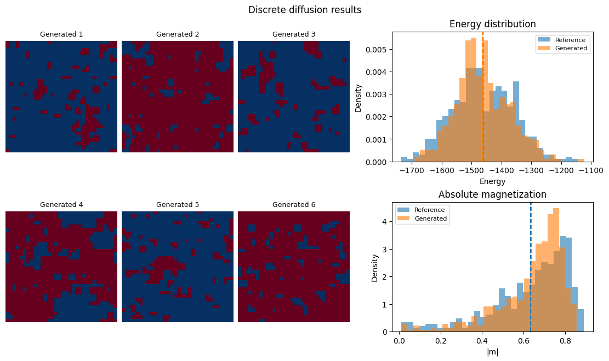

# Discrete Denoising Diffusion Probabilistic Model (D3PM) Synthesizing 2D Ising System Configurations

A Discrete Denoising Diffusion Probabilistic Model (D3PM) designed to generate two-dimensional spin configurations of the Ising model near its critical temperature. Built using Metropolis Monte Carlo sampling for dataset generation and a PyTorch U-Net that learns the distribution directly from simulated spin configurations.

## Overview

1. Generates $32\times32$ Ising configurations at $T=2.269$ using a Numba-compiled Metropolis algorithm.
2. Corrupts binary spin configurations over 300 discrete diffusion timesteps using a cosine schedule.
3. Trains a U-Net to predict clean configurations, then refines the learned reverse transition and stabilizes the final parameters using an exponential moving average (EMA).
4. Samples new spin configurations by reversing the binary diffusion process from Bernoulli noise.
5. Evaluates generated configurations against held-out simulations using energy and magnetization distributions.

## Ising Dataset

Using units where $J=1$, the zero-field ferromagnetic Ising Hamiltonian is given by:

$$
H = -J\sum_{\langle i,j\rangle}s_i s_j,
\qquad s_i\in\{-1,+1\}
$$

where the sum counts each nearest-neighbor pair once. Dataset configurations are sampled using periodic boundary conditions and Metropolis dynamics. At each step, a random site $(x,y)$ is proposed for a flip, with energy change:

$$
\Delta E = 2 J\, s_{x,y} \sum_{\text{neighbors}} s_{\text{nb}}
$$

The flip is accepted if $\Delta E \le 0$, or with probability $e^{-\beta \Delta E}$ otherwise, where $\beta=1/T$. One "sweep" is defined as $\text{size}^2$ single-spin update attempts.

## Discrete Diffusion Process

Spins are mapped to binary values $x_0\in\{0,1\}$. At timestep $t$, the forward process approaches a uniform Bernoulli distribution:

$$
q(x_t=1\mid x_0)=\frac{1}{2}+\bar{\alpha}_t\left(x_0-\frac{1}{2}\right)
$$

where $`\bar{\alpha}_t`$ follows a cosine schedule. The neural network predicts each spin's clean-state probability $`p_\theta(x_0\mid x_t,t)`$, which is combined with the exact binary posterior to construct the reverse transition $`p_\theta(x_{t-1}\mid x_t)`$.

Generation begins with Bernoulli noise and samples the learned reverse process over all 300 diffusion steps. A final random global spin flip applies the $\mathbb{Z}_2$ symmetry of the zero-field system without changing energy or absolute magnetization.

## Model Architecture & Training

The denoiser is a compact U-Net with circular convolutional padding, `48` and `96` feature channels, two downsampling stages and two upsampling stages, additive skip connections, SiLU activations, and a normalized timestep channel.

A single network is trained on 4,500 configurations in two stages; the remaining 500 configurations are held out for evaluation:

1. **Clean prediction:** binary cross-entropy with logits applied to the predicted clean-state logits and the target configuration.
2. **Reverse refinement:** binary cross-entropy between the predicted and exact per-spin reverse-transition probabilities, with a small clean-prediction term:

$$
\mathcal{L}_{\mathrm{refine}}
=\mathcal{L}_{\mathrm{reverse}}+0.05\,\mathcal{L}_{\mathrm{clean}}.
$$

During reverse refinement, an EMA with decay `0.9988` averages the parameter trajectory. Generation uses the final EMA parameters, reducing sensitivity to noisy late-stage updates.

## Results



Using 500 held-out reference configurations and 500 generated configurations, the saved run produced the following results. Energy is the total lattice energy with $J=1$, and magnetization is reported per spin.

| Metric | Reference | Generated |
|---|---:|---:|
| Mean energy | `-1462.0` | `-1463.8` |
| Energy standard deviation | `101.8` | `89.0` |
| Mean signed magnetization | `+0.0331` | `+0.0116` |
| Mean absolute magnetization | `0.6340` | `0.6383` |

The energy z-score was `-0.28`, with an energy KS statistic of `0.072` ($p=0.1497$) and a Wasserstein distance per spin of `0.0130`. The absolute-magnetization KS statistic was `0.132` ($p=0.0003237$). The model closely reproduces mean energy and mean absolute magnetization, while the low absolute-magnetization KS p-value indicates a remaining difference in the detailed distribution of global magnetization fluctuations.

### Key Parameters

| Parameter | Description | Value |
|---|---|---:|
| `temp` | Dataset temperature | `2.269` |
| `size` | Lattice dimensions | `32 × 32` |
| `sweeps` | Metropolis sweeps per configuration | `2000` |
| `samples` | Dataset configurations | `5000` |
| `DIFFUSION_STEPS` | Discrete diffusion timesteps | `300` |
| `batch_size` | Training batch size | `64` |
| `clean_epochs` | Clean-prediction epochs | `50` |
| `refinement_epochs` | Reverse-refinement epochs | `20` |
| `clean_lr` | Clean-prediction learning rate | `2e-4` |
| `refinement_lr` | Reverse-refinement learning rate | `5e-5` |
| `ema_decay` | EMA decay during refinement | `0.9988` |

## Requirements

```bash
pip install numpy scipy numba torch matplotlib jupyter
```

## Usage

The repository includes `ising_dataset_32x32.npy`. To regenerate it deterministically:

```bash
python dataset_generator.py
```

Launch Jupyter, open `diffusion_model.ipynb`, and run all cells:

```bash
jupyter notebook
```

The notebook trains both model stages, plots the batch-level loss curves, generates 500 new Ising configurations, and compares their energy and magnetization distributions with the held-out reference data.
